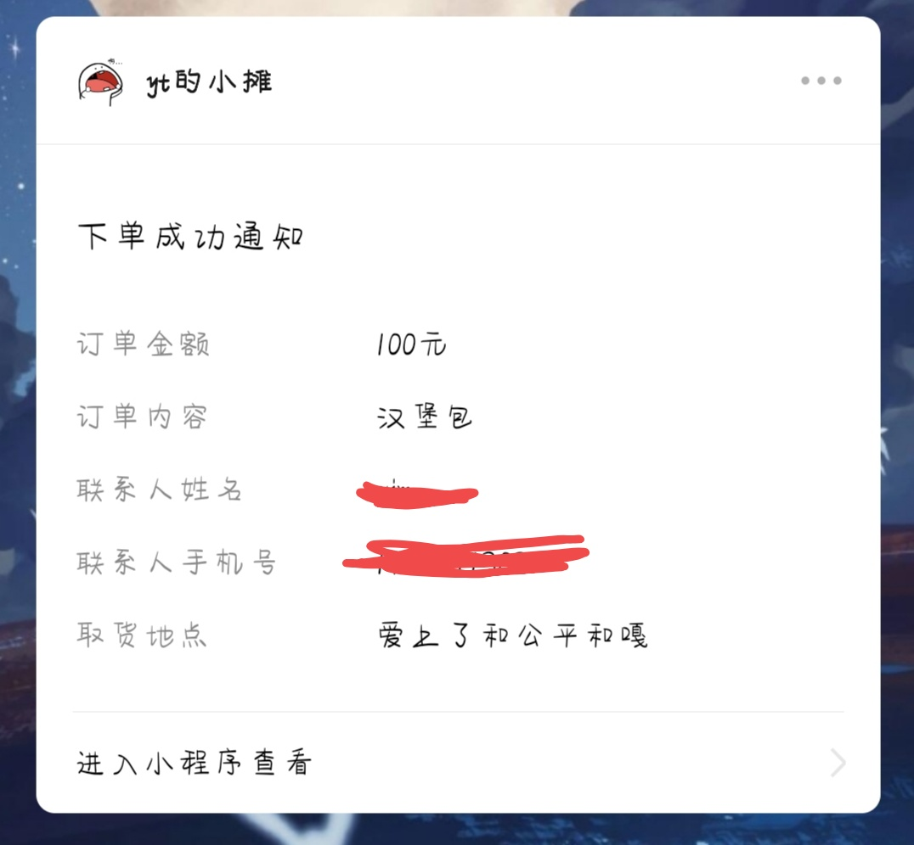
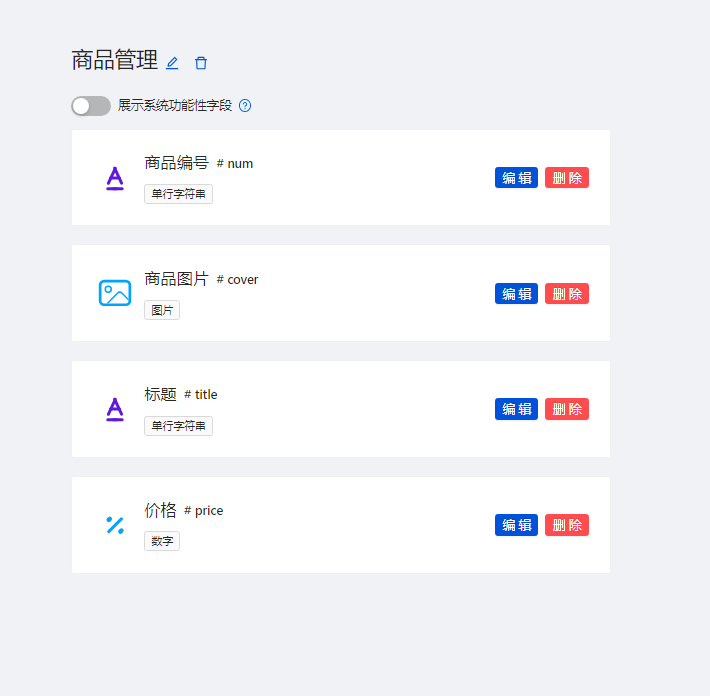
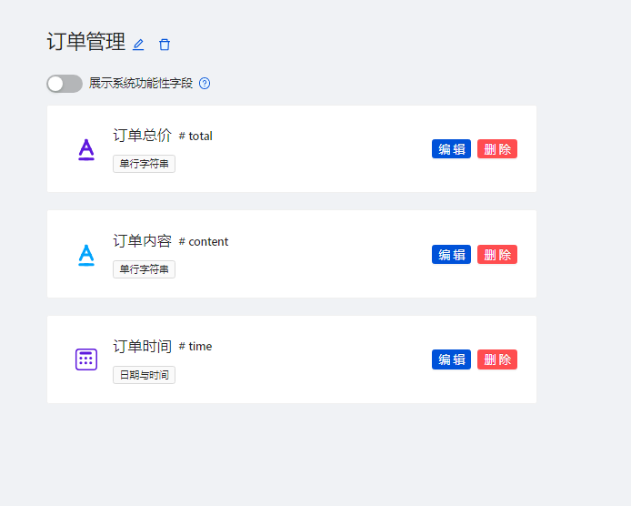
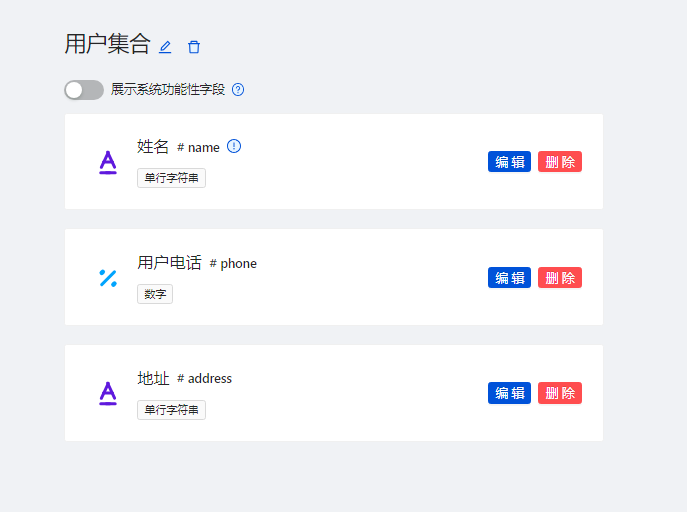
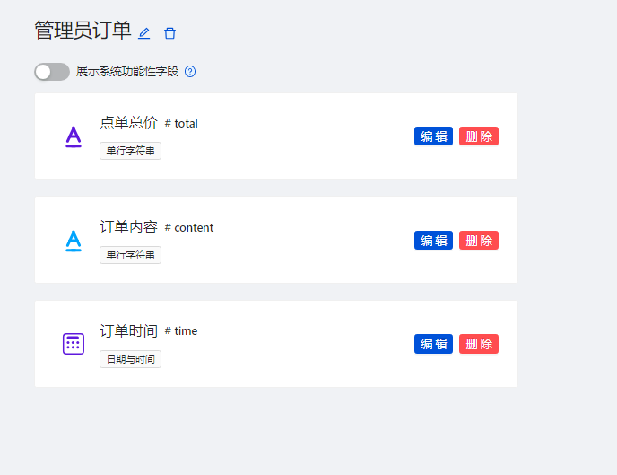

# 日志

* 朋友最近需要一款处理订单的小程序
* 自己平常很少开发类似的东西
* 就写个简单的练练手 顺便给自己刷点经验
* 技多不压身

## 使用注意事项

* 本小程序是基于微信云开发
* 个人商户无法开启支付功能
* 所以实现的是到付

## 开发注意事项
* 请在`project.config.json`中 修改你自己的 appid
```exp
  "appid": ""
```
* 在`project.config.json`中 配置自己的云函数根目录
```exp
"cloudfunctionRoot": "cloud/",
```
* 在`app.js`中配置自己的云开发环境
```exp
    wx.cloud.init({
      env:"自己的云开发环境id",
      traceUser:true
    });
```

## 开发日期

#### 2023-08-04

* 主前端界面框架的搭建
* 对登录日志的记录
* 首页、点单、购物车、订单、用户个人界面的编写 暂时还未完善
* 套用的模板 


* 页面与页面之间可以正常跳转
* 文件结构？

#### 2023-08-05

* 部署微信云开发
* 初始化云环境和云函数 云函数相当于小程序后台的代码 cloud 文件夹
* 对主页的图片显示进行优化

#### 2023-08-06

* 主页商品显示
* 渲染商品列表数据
* 对数据库中的商品进行显示


* 修改主页样式
* 取消登录页面？直接将订单信息分别发向管理者和用户
* 这样或许还简单一点
* 先将商品页面进行完善 后续进行订单的编写

#### 2023-08-08

* 实现从购物车界面跳转至下单界面 并将购物车中的数据传入到下单界面
* 解决订单中的问题 ---> 当商品删除后 再次刷新页面会导致商品重新出现
* 处理购物车界面存储异常 &#x2714;
* 购物车界面 ---> 订单界面
* 订单页面中内容无法正常显示 &#x2714;
* 订单处理
* 下单之后订单保存？下单之后应该将购物车清空 &#x2714;
* 购物车清空失败
* 在下单之前对用户信息是否填写进行判断 &#x2714;
* 逻辑存在问题？
* 对商户和客户发送的内容应该包括 user 信息 和 orders 内容 &#x2714;

#### 2023-08-09

* 本来是不想用前后端分离的 但是发现使用微信中的消息订阅还是需要使用微信云函数
* 最后还是前后端分离
* 设置消息订阅的云函数
* 实现订阅消息 



* 对订阅消息的内容进行完善

#### 2023-08-10

* 创建用户数据库 主要是获取用户的 openid 顺便保存一下用户的信息
* 处理订阅消息参数格式异常 包括 ---> 订单内容 undefined、手机号无法正常发送 &#x2714;
* 购物车价格获取异常 数量 bug &#x2714;
* 获取用户的 openid
* 数据库






* 管理员获得订单


* 优化订阅逻辑
* 后续对代码结构进行优化