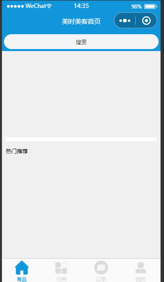
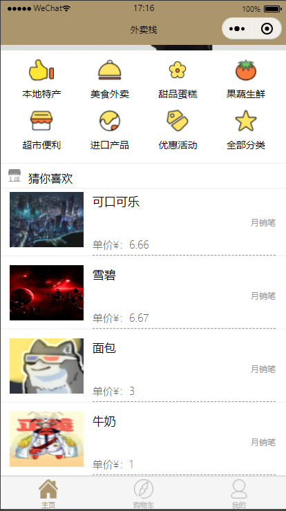

# 日志

* 朋友最近需要一款处理订单的小程序
* 自己平常很少开发类似的东西
* 就写个简单的练练手 顺便给自己刷点经验
* 技多不压身

## 使用注意事项

* 本小程序是基于微信云开发
* 个人商户无法开启支付功能
* 所以实现的是到付

## 开发注意事项
* 请在`project.config.json`中 修改你自己的 appid
```exp
  "appid": ""
```
* 在`project.config.json`中 配置自己的云函数根目录
```exp
"cloudfunctionRoot": "cloud/",
```
* 在`app.js`中配置自己的云开发环境
```exp
    wx.cloud.init({
      env:"自己的云开发环境id",
      traceUser:true
    });
```

## 开发日期

#### 2023-08-04

* 主前端界面框架的搭建
* 对登录日志的记录
* 首页、点单、购物车、订单、用户个人界面的编写 暂时还未完善
* 套用的模板 
* 
* 页面与页面之间可以正常跳转
* 文件结构？

#### 2023-08-05

* 部署微信云开发
* 初始化云环境和云函数 云函数相当于小程序后台的代码 cloud 文件夹
* 对主页的图片显示进行优化

#### 2023-08-06

* 主页商品显示
* 渲染商品列表数据
* 对数据库中的商品进行显示
* 
* 修改主页样式

